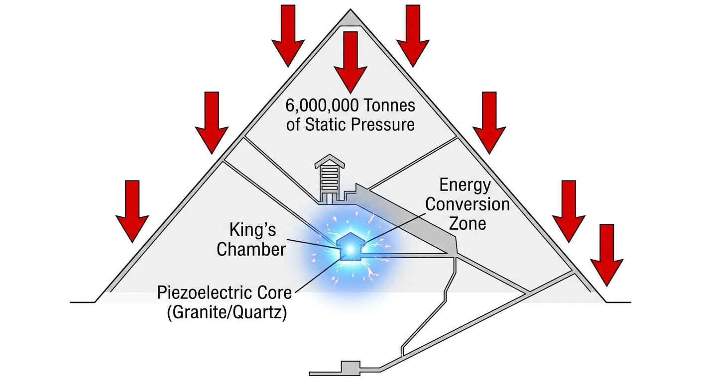
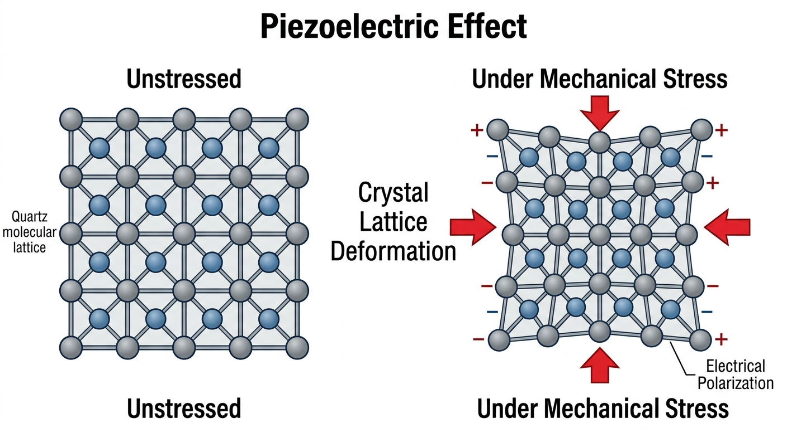
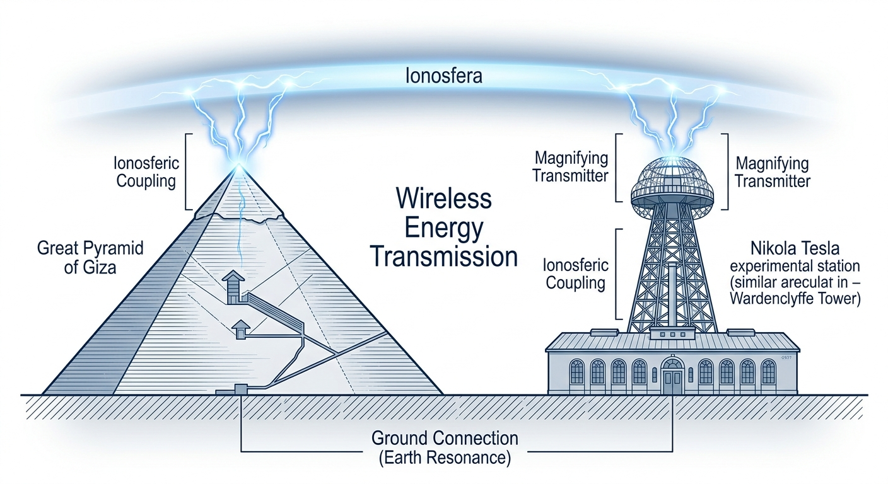

# Giza-Resonance-Power-Plant
Technical analysis and mathematical modeling of the Great Pyramid as a large-scale piezoelectric transducer.
# Giza Resonance Power Plant Protocol (GRPPP)
## Engineering Analysis of Large-Scale Piezoelectric Transduction

This repository contains the technical framework for the "Giza Power Plant" hypothesis, treating the Great Pyramid not as a tomb, but as a **solid-state energy harvester**.

### 🛠 Technical Specifications
* **Core Material:** Aswan Rose Granite (High Quartz $SiO_2$ content).
* **Mechanism:** Static Load Pressure + Acoustic Resonance.
* **Output:** Piezoelectric Voltage Conversion.
* **Transmission:** Ionospheric Coupling (Wireless Energy).

### 📊 Physics Overview
The structure acts as a **Helmholtz Resonator**. When seismic frequencies from the Giza plateau match the resonant frequency of the King's Chamber, the compressed quartz crystals generate a continuous electrical discharge.

---
*Note: This is an open-source engineering project aimed at replicating these effects in small-scale models.*

